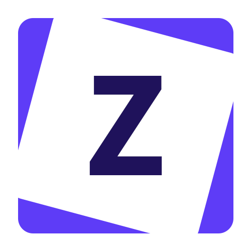

[![Issues][issues-shield]][issues-url]

<!-- PROJECT LOGO -->
 

  

  <h3 align="center">Zoks Project Manager</h3>

  

    Simple project manager
     
    <a href="https://zoksss.github.io/zoksprojectmanager/">View Demo</a>
    ·
    <a href="https://github.com/Zoksss/zoksprojectmanager/issues">Report Bug</a>
  

<!-- ABOUT THE PROJECT -->
## About The Project

[![Product Name Screen Shot][product-screenshot]](https://zoksss.github.io/zoksprojectmanager/)

Simple project manager made in ReactJS.

### Built With

*Front End*

* [REACT](https://reactjs.org/)
* [ReactSpring](https://react-spring.dev/)
* [SASS](https://sass-lang.com/)

<!-- MARKDOWN LINKS & IMAGES -->
<!-- https://www.markdownguide.org/basic-syntax/#reference-style-links -->
[stars-shield]: https://img.shields.io/github/stars/othneildrew/Best-README-Template.svg?style=for-the-badge
[stars-url]: https://github.com/Zoksss/zoksprojectmanager/stargazers
[issues-shield]: https://img.shields.io/github/issues/othneildrew/Best-README-Template.svg?style=for-the-badge
[issues-url]: https://github.com/Zoksss/zoksprojectmanager/issues
[license-shield]: https://img.shields.io/github/license/othneildrew/Best-README-Template.svg?style=for-the-badge
[license-url]: https://github.com/othneildrew/Best-README-Template/blob/master/LICENSE.txt
[linkedin-shield]: https://img.shields.io/badge/-LinkedIn-black.svg?style=for-the-badge&logo=linkedin&colorB=555
[product-screenshot]: ./zoksprojectmanager%20test.png
